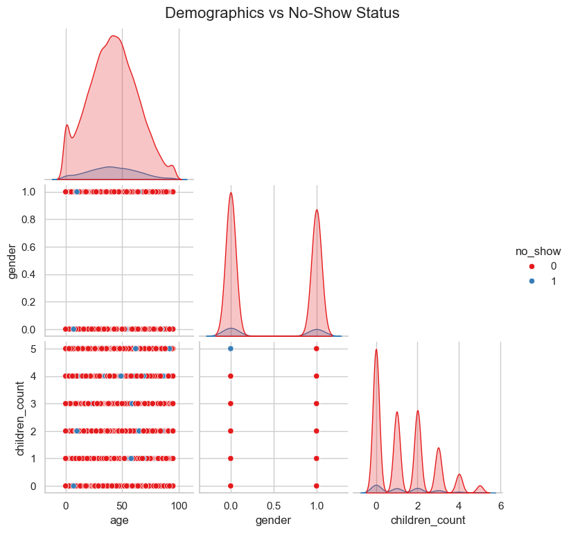

# Healthcare No Show Prediction
In this project, I analyzed different factors that reflect on the outcome of patients showing up or not showing up in the date of their next appointment. I used Python to make graphs and also provided necessary insights.

# Objective
This project analyzes a synthetic healthcare dataset to identify the behavioral, clinical, and operational factors driving patient appointment no-shows. Using Exploratory Data Analysis, we extract actionable insights to help clinics optimize scheduling protocols, improve resource allocation, and proactively reduce the rate of missed appointments.

# Dataset
Contains age, gender, appointment dates, waiting days, patients' living area, transportation type, weather of the day, patients' medical condition, sms, reminder calls count, children count, occupation, and more fields to finally predict the show/no-show dependencies.

# Data Cleaning
1. Handled missing values
2. Converted data types
3. Removed inconsistencies and duplicates
4. Standardized column names

# Exploratory Data Analysis (EDA)
### Univariate Analysis:
### Bivariate Analysis:
### Multivariate Analysis
# Machine Learning

# Key Insights
1. There is a clear positive correlation between longer wait times and higher no-show rates. Patients forced to wait several weeks are highly prone to missing their appointments.
2. Patients managing chronic conditions (Group 1) have a visibly lower no-show: show ratio than healthier patients (Group 0). This suggests that the ongoing necessity of disease management acts as a protective factor against missed appointments, making these patients inherently more reliable.
3. The 'Retired' cohort demonstrated the lowest proportional no-show rate of any employment category. This indicates that schedule flexibility and healthcare prioritization lead to superior appointment adherence for this group.
4. Looking strictly at absolute counts, the shape of the no-show distribution identically mirrors the overall attendance volume. Missed appointments essentially scale proportionally with the baseline age demographics, requiring deeper normalized percentage calculations to isolate specific age-based risks.
5. Age and Gender differences are not strong predictors for whether a patient would show up or not.
6. Low to middle-class-income people are more likely to show higher no_show rates.
7. Some patients rarely miss an appointment. If the patient has a previous history of no_shows he/she is likely to miss more appointments.
8. According to this specific dataset, previous SMS and reminder calls are not strong predictors of whether a patient will show up or not.

# Images
### Chronic Disease vs No Show

* Patients with Chronic Diseases are more likely to show up in the follow dates.
---
### Demographics vs No Show

* **Class Imbalance:** The density plots (diagonal) clearly illustrate a significant imbalance, with the vast majority of patients attending their appointments (Class 0).
* **Feature Relationships:** The scatter distributions between `age`, `gender`, and `children_count` do not reveal strong linear correlations or distinct clusters that isolate the no-show instances (Class 1), suggesting that behavioral or clinical factors may be stronger predictors than basic demographics alone.
